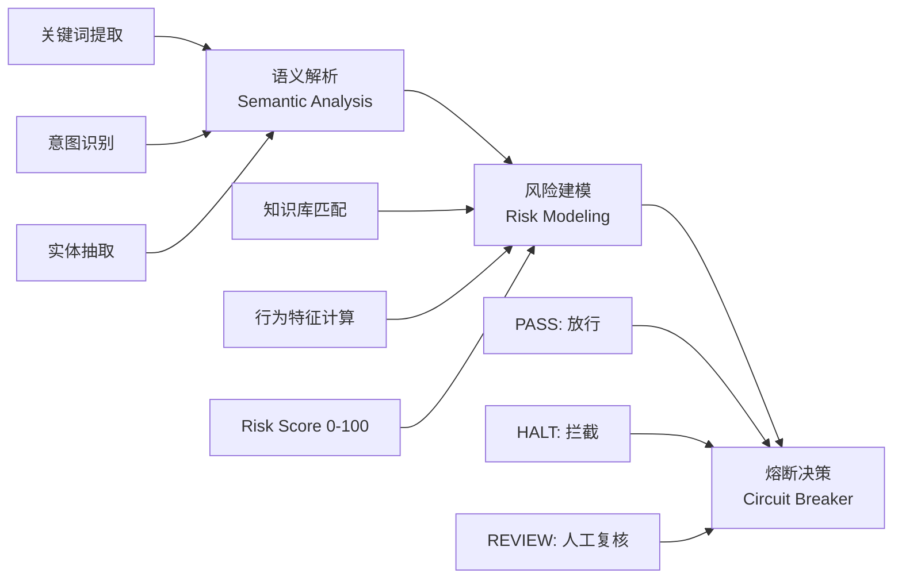

# NODE AI —— 跨境支付 AI 原生合规审计引擎 (PRD)

**版本**：v0.1  
**日期**：2026-03-28  
**作者**：独立开发者（Trae + Kiro vibe coding）

## 一、产品定义 (Product Definition)

### 1.1 项目背景

2026 年全球跨境电商与跨国转账规模持续爆发,同时面临高频洗钱（AML）、电信诈骗、诱导性任务（如"JD 换汇"）等合规风险。传统规则引擎滞后,通用大模型易产生"幻觉",难以直接用于高置信度金融决策。

### 1.2 产品定位

**NODE AI** 是一款专为跨境支付场景打造的 **数字首席风控官 (dCRO)**。  
它采用 "逻辑预处理 + 专家知识库检索 + 实时插件比对" 的三层架构,提供高置信度的合规审计建议,助力出海商户/平台实现 "每笔流水必审,每笔支付必安"。

### 1.3 核心价值（Slogan）

**Audit Every Flow. Secure Every Pay.**

## 二、技术架构 (Technical Architecture)

### 2.1 产品架构

产品核心决策流程遵循三阶段模型：



**核心逻辑**：
- **语义解析**：从用户输入中提取交易关键信息（金额、地区、支付方式、关键词等）
- **风险建模**：基于专家知识库和行为特征,计算 0-100 风险评分
- **熔断决策**：根据评分和规则,输出 PASS/HALT/REVIEW 三种决策

### 2.2 技术架构

系统采用前后端分离 + AI 中台的架构设计：

```mermaid
flowchart TB
    subgraph Frontend["前端层 - Next.js 15"]
        A[交互界面<br/>React 18 + Tailwind CSS]
        B[实时仪表盘<br/>Risk Score + Thought Chain]
        C[日志系统<br/>Real-time Logs]
    end
    
    subgraph Backend["服务端中转 - Next.js API Routes"]
        D[/api/audit<br/>审计接口]
        E[环境变量隔离<br/>Vercel Env]
    end
    
    subgraph AI["AI 专家内核 - Coze"]
        F[模式识别<br/>Python 节点]
        G[RAG 知识库<br/>合规条例检索]
        H[Workflow 编排<br/>强制 JSON 输出]
    end
    
    A --> D
    D --> F
    F --> G
    G --> H
    H --> D
    D --> B
    D --> C
```

**技术要点**：

1. **Next.js 15 服务端中转**
   - API Routes 作为中间层,前端不直接暴露 Coze API Token
   - 服务端处理超时、重试、错误格式化
   - 支持 180 秒长连接（Coze 推理耗时 30-60 秒）

2. **Coze 专家内核**
   - 模式识别：Python 节点提取关键词,判断普通/专家模式
   - RAG 知识库：存储合规条例、诈骗案例、黑名单等
   - 强制 JSON 输出：避免自然语言幻觉,确保结构化返回

3. **Vercel 环境变量隔离**
   - `.env.local` 存储敏感配置（COZE_API_KEY, COZE_BOT_ID）
   - 生产环境通过 Vercel Dashboard 配置
   - 支持多环境部署（dev/staging/prod）


## 三、功能规范 (Functional Specifications)

### 3.1 审计仪表盘 (Dashboard)

- **Risk Score**：0-100 动态半圆仪表盘（绿色安全 → 红色高危）
- **Thought Chain**：垂直时间线展示 AI 决策路径（提取 → 检索 → 建模 → 判定）
- **Real-time Logs**：滚动展示审计记录,支持 SUCCESS / WARNING / ERROR 级别

### 3.2 安全与合规

- 所有 Coze API 调用均在服务端完成,前端不暴露 Token
- 返回结构化 JSON（避免原始 Prompt 泄露）
- 专家模式强制引用知识库原始条目,减少幻觉

### 3.3 演示 Case 矩阵

| 触发场景             | 预期模式       | 视觉/行为反馈                          |
|----------------------|----------------|----------------------------------------|
| 普通问候             | 普通模式       | 荧光绿常规显示                         |
| "JD 换汇任务"        | 专家模式       | 进入 Audit Mode,加载详细思维链        |
| 缅甸 IP + 1万刀转账  | 熔断逻辑       | 全屏红闪脉冲 + 拦截建议弹窗           |

## 四、路线图 (Roadmap)

- [x] Phase 1：Coze 审计内核构建与 API 发布  
- [x] Phase 2：Trae 前端 Bloomberg 工业风格面板开发与对接  
- [ ] Phase 3：极端对抗性测试 + 5 份拦截报告生成  
- [ ] Phase 4：Vercel 一键部署 + 路演 PPT 打磨  

## 五、API 规范 (API Specifications)

### 5.1 审计接口

**Endpoint**: `POST /api/audit`

**Request Body**:
```json
{
  "message": "用户输入的交易描述或流水信息"
}
```

**Response** (成功):
```json
{
  "score": 85,
  "decision": "HALT",
  "thought_chain": [
    "检测到关键词: JD, 换汇, 拆单",
    "匹配知识库: 诱导性任务诈骗模式",
    "计算风险评分: 85/100",
    "触发熔断规则: score > 80"
  ],
  "ai_response": "检测到高风险诱导性任务,建议立即拦截并人工复核"
}
```

**Response** (错误):
```json
{
  "error": "审计服务暂时不可用,请稍后再试"
}
```

## 六、风险与挑战 (Risks & Challenges)

### 6.1 技术风险

- **Coze API 稳定性**：依赖第三方服务,需要完善重试和降级机制
- **推理延迟**：30-60 秒响应时间,需要优化用户体验（加载动画、进度提示）
- **知识库时效性**：合规条例更新频繁,需要建立定期同步机制

### 6.2 产品风险

- **误报率**：过于严格可能影响正常交易,需要持续调优阈值
- **漏报率**：新型诈骗手法可能绕过现有规则,需要快速迭代知识库

---

**附加建议（Implementation Notes）**  
- 在前端增加 **Quick Test 按钮**（一键填充演示 Case）
- README.md 中引用本 PRD,体现系统化思维
- 考虑增加"查看系统架构"入口,方便演示和文档查阅
